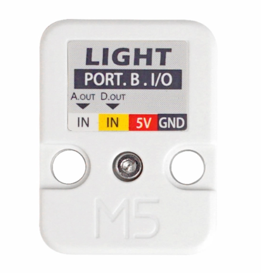

# Idée pour dédection d'objet dans le cadre du projet final

## Détection par l'absence de lumière

### Objectif
1. insérer un détecteur d'intensité de lumière sur une surface.
2. Placer un object X sur le détecteur pour enclancher une fonction Y

### Désavantage
* On pourrais placer n'importe quelle objet dessus et la fonction Y serais activé.
  
### Utilité
utilisé un object X pour blocker la lumière et activer fonction Y.

## Détection par l'intensité d'un laser

#### référence
[Github du cours d'espace interactif de Thomas](https://tim-montmorency.com/rel-electro-immersif/m5stack/unit_light.html)
